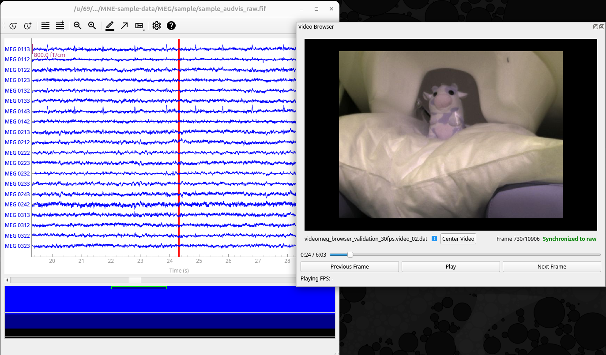

# Video browser extension for MNE Python's qt raw data browser

**Work in progress.** This project is based on [Helsinki VideoMEG project](https://github.com/Helsinki-VideoMEG-Project)
and currently works with video files recorded using software from that project.


Screenshot of the browser extension showing video from our validation measurement (in which a plushie named Herba kindly
volunteered to be the test subject), synchronized with MNE-Python's sample MEG data.

## Installation for development

In addition to MNE-Python, this project currently requires package `OpenCV` for standard video file (such as .mp4) reading
and `sounddevice` for audio playback. Here's how to set up an environment with all the necessary dependencies:

1. Create a new conda environment (named `mne-videomeg`) with MNE-Python and sounddevice.

   ```bash
   conda create --channel=conda-forge --strict-channel-priority --name=mne-videomeg mne python-sounddevice
   ```

2. Activate the environment:

   ```bash
   conda activate mne-videomeg
   ```

3. Add light version of `OpenCV` to the environment:

   ```bash
   pip install opencv-python-headless
   ```

4. Clone this repository and navigate to project root.

5. Install the package in editable mode:

   ```bash
   pip install -e .
   ```

Now you should be able to test the video browser by running example scripts in `scripts/` directory. For example:

```bash
python scripts/run_sync_demo_with_sample_data.py
```

Script `run_sync_demo_with_sample_data.py` uses a sample dataset from MNE Python and a fake video file. Other examples require you
to have your own raw data and video files in a correct format.

## Running tests

Tests are located in directory `tests/` and they run using package `pytest`. You can install it to your environment by running:

```bash
pip install -e .[dev]
```

Then you can run all the tests with:

```bash
pytest
```

You can also selectively run tests in a specific file/class/method. See [pytest documentation](https://docs.pytest.org/en/stable/how-to/usage.html) for details.
